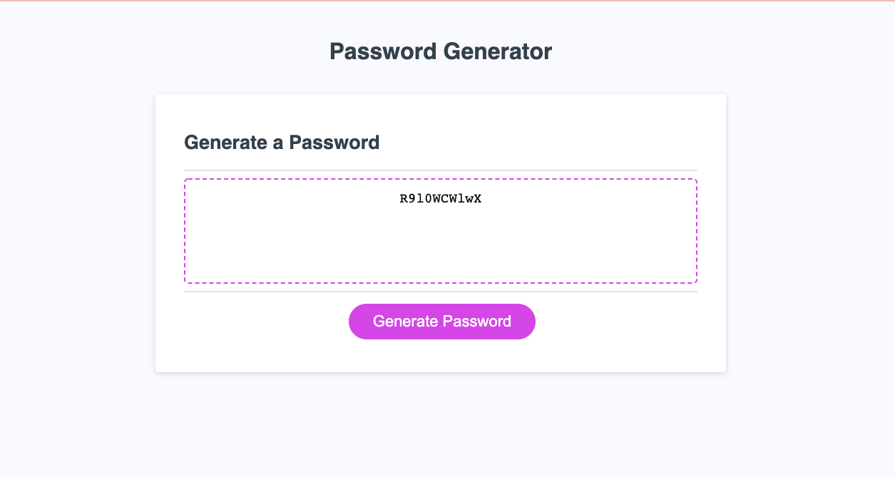

## Random Password Generator

This program will create a random password that takes user input on the number and type of characters that the user would like for their random password.

## Completed Assignment

This image shows the completed assignment's appearance and functionality:

## Link to Deployed Site

TODO: ADD LINK TO DEPLOYED SITE

https://knolan18.github.io/password-generator/
